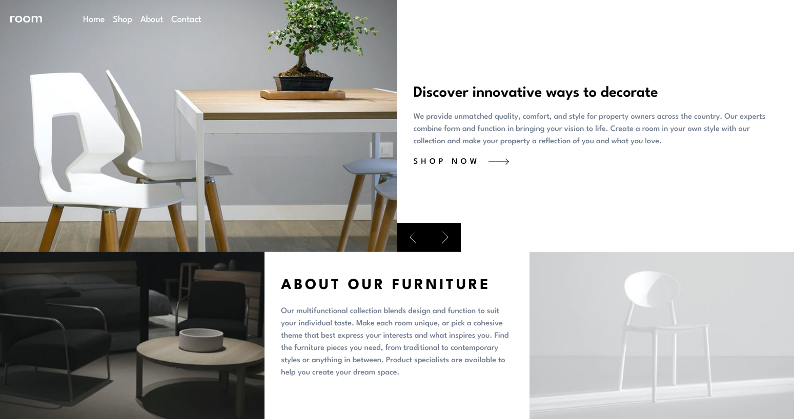

## Overview

### The challenge

Users should be able to:

-   View the optimal layout for the site depending on their device's screen size
-   See hover states for all interactive elements on the page
-   Navigate the slider using either their mouse/trackpad or keyboard

### Screenshot

## My process

### Built with

-   Semantic HTML5 markup
-   Tailwind CSS
-   Flexbox
-   CSS Grid
-   Mobile-first workflow
-   [React](https://reactjs.org/) - JS library
-   [GSAP](https://gsap.com/) - GSAP library

### What I learned

I learned how to implement and use Tailwind CSS and GSAP for the first time, and it was super easy to use.

By using GSAP we can build next level websites. I implemented little bit of animations by using GSAP. In future I will get implemented more of using GSAP.
